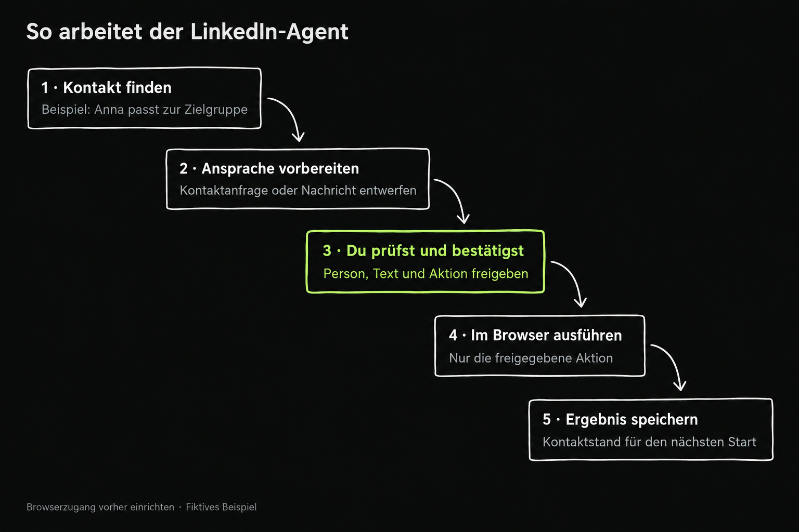

# og-linkedin-outreach

LinkedIn-Kontakte recherchieren, Kommentare und Vernetzungsanfragen vorbereiten, Nachrichten und Antworten bearbeiten.

Ein deutsches Agentenpaket für **Claude Code und Codex** mit geführter Einrichtung, Arbeitsanleitungen und einem lokalen Kontaktregister. Du prüfst Empfänger und fertige Texte als Paket. Erst deine Freigabe startet die externe Ausführung.



## Start

Voraussetzungen: Python 3.10 oder neuer, Claude Code oder Codex und eigene Konten bei den benötigten Diensten. Die Nutzung externer Dienste kann Kosten verursachen.

```sh
git clone https://github.com/christophercallejongarcia/og-linkedin-outreach.git
cd og-linkedin-outreach
python3 scripts/agent.py init
```

Öffne diesen Ordner in deiner Agentenlaufzeit. Schreibe:

> Richte og-linkedin-outreach mit mir ein. Frage mich schrittweise nach Zielgruppe, Angebot und vorhandenen Werkzeugen. Prüfe die Verbindungen zuerst lesend. Bereite danach ein kleines erstes Kontaktpaket vor.

Claude Code liest CLAUDE.md und bietet `/og-linkedin-outreach`. Codex liest AGENTS.md und den Projekt-Skill `$og-linkedin-outreach`. Falls die Oberfläche keine Skill-Auswahl zeigt, genügt der obige Auftrag im geöffneten Projekt. Anleitungen: [Claude Code](docs/claude-code.md), [Codex](docs/codex.md), [Einrichtung](workflows/einrichtung.md).

## Ablauf

1. [Recherche](workflows/recherche.md)
2. [Kontakte](workflows/kontakte.md)
3. [Interaktionen](workflows/interaktionen.md)
4. [Inbox](workflows/inbox.md)
5. [Content](workflows/content.md)

[Werkzeuge und Einrichtung](docs/werkzeuge.md) erklären die benötigten Verbindungen. Anbieter lassen sich austauschen, sofern die benötigten Fähigkeiten tatsächlich vorhanden sind. Browser- und Versandaktionen führt die Agentenlaufzeit aus. Das lokale Python-Werkzeug hat keinen Netzwerkzugriff und sendet selbst nichts.

## Kontakte bleiben erhalten

Jedes Repo führt sein eigenes Register unter data/. Nach jedem Schritt entstehen lesbare Tabellen kontakte.csv und aktionen.csv sowie ein Ereignisprotokoll. SQLite ist die maßgebliche Quelle. Ein Neustart liest diesen Stand. Persönliche Daten und Zugangsdaten gehören nicht ins öffentliche Repo. [Register](docs/register.md) · [Befehle](docs/befehle.md).

## Freigabe und Wiederaufnahme

Ein Paket enthält konkrete Empfänger, Absender, Aktionen und endgültige Texte. Änderungen verwerfen die Freigabe. Vor jeder externen Aktion wird sie lokal reserviert. Unklare Ergebnisse werden geprüft, bevor ein neuer Versuch beginnt. Antworten stoppen offene Folgeaktionen; gesperrte Kontakte werden nicht erneut reserviert. [Paketablauf](workflows/paketfreigabe.md) · [Sicherheitsgrenzen](SICHERHEIT.md).

Diese Kontrollen gelten für das lokale Register. Sie ersetzen weder Plattformberechtigungen noch die Prüfung eines externen Versandkontos. Freigabebelege muss der Agent aus der wirklichen Nutzerzustimmung übernehmen.

## Prüfung

```sh
python3 -m unittest discover -s tests -v
python3 scripts/check_package.py
```

Die automatischen Tests prüfen lokale Freigaben, Zustände, Unterbrechungen und konkurrierende Reservierungen mit fiktiven Daten. Echte Browseraktionen und Providerzugänge werden erst bei deiner Einrichtung geprüft. Es werden keine Live-Sends als getestet behauptet.

## Lizenz

Der neu geschriebene Code und die Anleitungen stehen unter der [MIT-Lizenz](LICENSE).
